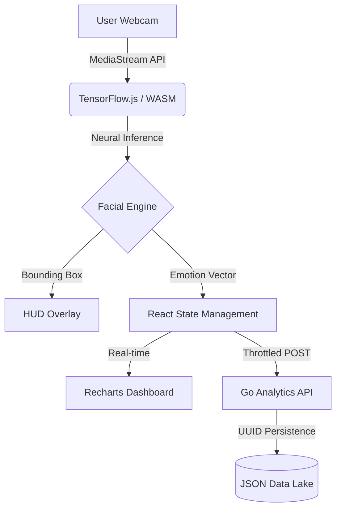

# <p align="center">🧠 FacePulse AI — Real-Time Biometric Intelligence SaaS</p>

<p align="center">
  
  
  
  
  
</p>

---

## 🚀 Overview
**FacePulse AI** is a state-of-the-art, startup-grade biometric intelligence platform. It leverages high-performance WebAssembly (WASM) neural networks to deliver real-time facial expression analysis directly in the browser. Designed with a futuristic HUD (Heads-Up Display) aesthetic, it provides users with a professional command-center experience for behavioral analytics.

The system is split into a **Next.js 15 Reactive Dashboard** and a **distributed Go Backend Service**, ensuring scalability and micro-second precision in data handling.

---

## ✨ Key Features

### 📡 Neural Vision System
- **HUD-Drive Interface**: Pixel-perfect facial tracking with dynamic coordinate scaling.
- **Micro-Expression Detection**: Categorizes 7 core human emotions (Happy, Sad, Angry, Surprised, Disgusted, Fearful, Neutral).
- **Sub-100ms Inference**: Optimized `TinyFaceDetector` weights for maximum FPS on varied hardware environments.
- **Privacy-First**: All biometric processing happens locally on the client's GPU/CPU; no video data ever leaves the local machine.

### 📊 Advanced Analytics Dashboard
- **Cognitive Mix (Pie Chart)**: High-resolution breakdown of emotional states throughout the session.
- **Intensity Timeline (Area Chart)**: Real-time visualization of emotional spikes and troughs.
- **Session Lifecycle**: Full CRUD operations for behavioral sessions with persistent storage in the Go Data Lake.
- **Data Export**: One-click professional JSON export for research integration.

### 🛠️ System HUD & Performance
- **Live Performance Telemetry**: Real-time tracking of Inference FPS and Model Latency.
- **Backend Sync Pulse**: Visual indicator for connectivity status with the Go biometric server.
- **WASM Acceleration**: Exploits hardware acceleration for neural computations via browser threads.

---

## 🏗️ Technical Architecture

### System Flow


### Dependency Deep-Dive
- **Frontend Core**: `Next.js 15` (App Router), `React 19`, `TypeScript`.
- **UI Architecture**: `Tailwind CSS v4`, `Framer Motion` (Animations), `Lucide React` (Icons).
- **Neural SDK**: `vladmandic/face-api` (Custom ESM build for Next.js compatibility).
- **Backend Service**: `Go 1.23` with standard library for high-throughput HTTP handling.

---

## 🚀 Installation & Deployment

### 1. Repository Setup
```bash
git clone https://github.com/your-username/facepulse-ai.git
cd facepulse-ai
```

### 2. Biometric Backend Server (Go)
The backend manages session persistence and global analytics.
```powershell
# Navigate to services
cd backend-go

# Using portable environment (Windows)
.\go\bin\go.exe run main.go

# Standard installation
go mod tidy
go run main.go
```
*Server live at:* `http://localhost:8080`

### 3. Intelligence Dashboard (Next.js)
```bash
# Navigate to UI
cd frontend

# Install dependencies
npm install

# Start development environment
npm run dev
```
*Frontend live at:* `http://localhost:3000`

---

## 🗺️ Product Roadmap
- [ ] **Phase 1**: (Completed) Real-time single-face emotion tracking and HUD.
- [ ] **Phase 2**: (In Progress) Multi-person biometric concurrency support.
- [ ] **Phase 3**: Micro-expression "Lie Detection" scoring algorithm.
- [ ] **Phase 4**: Enterprise PostgreSQL / MongoDB integration for large-scale data retention.
- [ ] **Phase 5**: Real-time alerting system for high-stress behavioral triggers.

---

## 🛡️ Security & Privacy
- **Processing**: All neural inference is client-side.
- **Auth**: Designed for easy integration with OAuth2/JWT (See Enterprise roadmap).
- **Security**: Refer to [SECURITY.md](SECURITY.md) for vulnerability reporting.

---

## 🤝 Contributing
We welcome contributions from the community! Whether it's neural model optimization or UI enhancements, check out [CONTRIBUTING.md](CONTRIBUTING.md) to get started.

---

## 📄 License
This project is licensed under the **MIT License**. See the [LICENSE](LICENSE) file for details.

---

<p align="center">
  Developed with Precision & 💎 by the <b>FacePulse AI Engineering Team</b>
</p>
