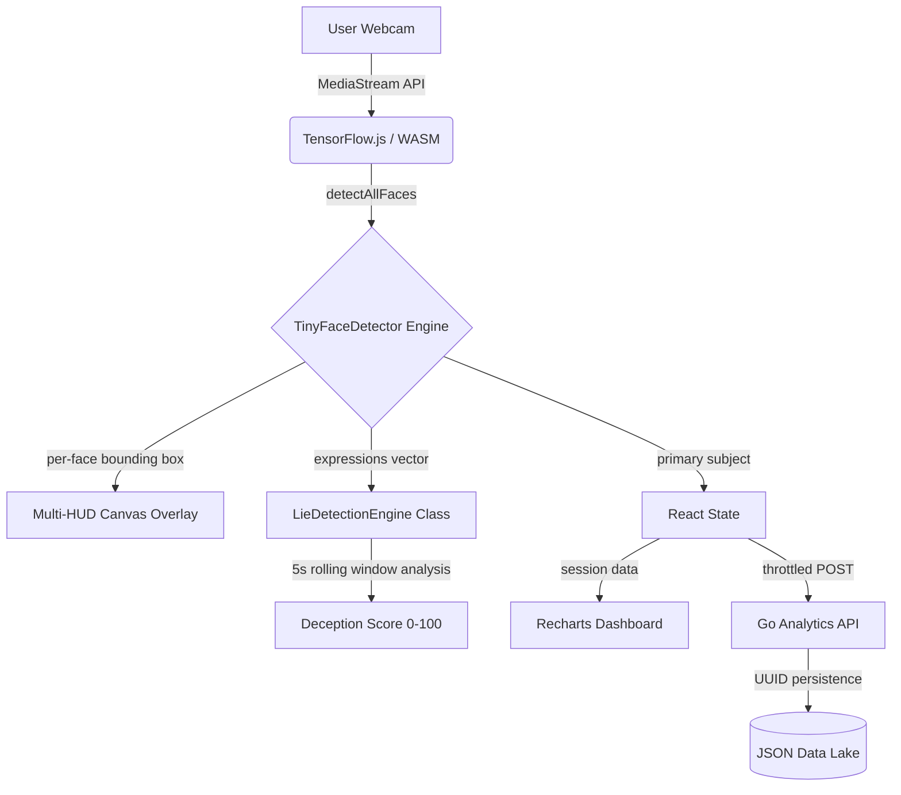

# <p align="center">🧠 FacePulse AI — Real-Time Biometric Intelligence SaaS</p>

<p align="center">
  
  
  
  
  
  
</p>

<p align="center">
  <strong>Real-time AI-powered facial emotion analytics · Multi-person tracking · Lie Detection scoring · Go-powered backend</strong>
</p>

---

## 🚀 Overview

**FacePulse AI** is a production-grade Biometric Intelligence Platform. It combines a **high-performance WebAssembly neural engine** with a **futuristic HUD command-center UI** to deliver instant, actionable human behavioral insights — right from the browser.

Built on **Next.js 15, React 19, and a Go 1.23 REST backend**, FacePulse AI supports concurrent multi-person tracking, a proprietary micro-expression Lie Detection algorithm, and professional session analytics — with **zero video data ever leaving the device**.

---

## ✨ Features at a Glance

| Feature | Description |
| :--- | :--- |
| 🎯 **Phase 1 — HUD Vision** | Single-face detection with dynamic bounding box, confidence bar, and emotion label |
| 👥 **Phase 2 — Multi-Subject** | Track unlimited concurrent subjects with per-person color-coded HUD overlays |
| 🔍 **Phase 3 — Lie Detector** | 4-factor micro-expression deception scoring algorithm with animated radial gauge |
| 📊 **Analytics Dashboard** | Real-time emotion distribution pie chart and longitudinal intensity timeline |
| ⚡ **Performance HUD** | Live FPS, latency, and backend synchronization monitoring |
| 🔒 **Privacy-First** | All AI inference runs locally in the browser via WASM — no video data ever transmitted |
| 📤 **Data Export** | One-click JSON session export for offline research integration |

---

## 🏗️ Technical Architecture

### System Flow


### Directory Structure
```
facepulse-ai/
├── frontend/
│   ├── ai/
│   │   ├── modelLoader.ts        # TinyFaceDetector model bootstrapping
│   │   ├── emotionEngine.ts      # detectAllFaces → DetectionResult[]
│   │   └── lieDetector.ts        # Phase 3: 4-factor deception algorithm
│   ├── components/
│   │   ├── camera/CameraView.tsx         # Multi-face HUD canvas renderer
│   │   ├── charts/EmotionPie.tsx         # Gradient donut distribution chart
│   │   ├── charts/EmotionTrend.tsx       # Area timeline chart
│   │   └── dashboard/
│   │       ├── LieDetectorPanel.tsx      # Radial gauge + indicator list
│   │       ├── PerformanceMonitor.tsx    # FPS/Latency/Status HUD
│   │       └── Sidebar.tsx              # Minimal navigation shell
│   ├── hooks/
│   │   ├── useCamera.ts           # Camera stream lifecycle
│   │   └── useEmotionDetection.ts # Detection loop + lie engine bridge
│   └── app/
│       ├── page.tsx               # Main dashboard (tabs: Analytics / Multi-Subject / Lie Detector)
│       └── layout.tsx
└── backend-go/
    ├── main.go                    # HTTP server, session routing
    └── internal/
        ├── handlers/              # REST endpoint handlers
        └── services/              # Session business logic
```

---

## 🔬 Lie Detection Algorithm (Phase 3)

The deception scoring is inspired by Paul Ekman's micro-expression research (1969). The system uses a **5-second rolling window** and scores on 4 independent factors:

| Factor | Max Points | Signal |
| :--- | :--- | :--- |
| **Emotional Masking** | 20 pts | Neutral/Happy used to conceal fear/anger/sadness |
| **Micro-Expression Volatility** | 30 pts | Rapid emotional switching within the window |
| **Fear/Anger Leakage** | 25 pts | Brief flashes of negative emotion immediately suppressed |
| **Low-Confidence Neutral** | 15 pts | "Forced" neutral scored below 50% confidence |

**Score Interpretation:**
- `0–24` → 🟢 **Truthful** — Consistent emotional baseline
- `25–49` → 🟡 **Low Risk** — Minor inconsistencies
- `50–74` → 🟠 **Suspicious** — Deception indicators present
- `75–100` → 🔴 **Deceptive** — Strong micro-expression leakage

> ⚠️ **Disclaimer**: This tool is for educational purposes only, based on behavioural science research. It is **not** intended for legal, medical, employment, or judicial use.

---

## 🚀 Installation & Quick Start

### Prerequisites
- **Node.js** v20+
- **Go** v1.21+ (or use bundled portable v1.23 in `backend-go/go/`)

### 1. Clone Repository
```bash
git clone https://github.com/krishanth7/facepulse-ai.git
cd facepulse-ai
```

### 2. Start Go Backend
```powershell
cd backend-go

# Portable (no Go install needed)
.\go\bin\go.exe run main.go

# Global Go installation
go mod tidy && go run main.go
```
*Backend: `http://localhost:8080`*

### 3. Start Next.js Frontend
```bash
cd frontend
npm install
npm run dev
```
*Dashboard: `http://localhost:3000`*

### 4. Using the Dashboard
1. Click **"Initialize Core"** to start your webcam session.
2. Watch the **HUD Vision** track all faces in real-time.
3. Switch to the **Multi-Subject** tab to see per-person emotion breakdowns.
4. Switch to the **Lie Detector** tab to see the live deception score.
5. Click **"Export Log"** to download your session as JSON.

---

## 📊 REST API Reference

| Method | Endpoint | Description |
| :--- | :--- | :--- |
| `POST` | `/api/session/start` | Initialize a new biometric session |
| `POST` | `/api/analytics` | Stream real-time emotion telemetry |
| `POST` | `/api/session/end` | Finalize and archive session |
| `GET` | `/api/sessions` | Retrieve all historical sessions |

---

## 🗺️ Product Roadmap

- [x] **Phase 1** — Real-time single-face emotion tracking and HUD
- [x] **Phase 2** — Multi-person biometric concurrency support (unlimited subjects)
- [x] **Phase 3** — Micro-expression "Lie Detection" scoring algorithm (4-factor)
- [ ] **Phase 4** — Enterprise PostgreSQL / MongoDB integration
- [ ] **Phase 5** — Real-time alerting for high-stress detection (Slack/WhatsApp)
- [ ] **Phase 6** — Longitudinal session comparison and behavioral reporting

---

## 🛡️ Security & Privacy

- All AI inference is **fully local** (client-side WebAssembly).
- No biometric video data is ever transmitted over the network.
- The Go backend receives only processed emotion label strings and confidence scores.
- For vulnerability reporting, see [SECURITY.md](SECURITY.md).

---

## 🤝 Contributing

Community contributions are welcome! See [CONTRIBUTING.md](CONTRIBUTING.md) for guidelines on coding standards and the PR process.

---

## 📄 License

Licensed under the **MIT License**. See [LICENSE](LICENSE) for full details.

---

<p align="center">
  Developed with precision & 💎 by <b>krishanth7</b>
  <br/>
  <a href="https://github.com/krishanth7/facepulse-ai">github.com/krishanth7/facepulse-ai</a>
</p>
